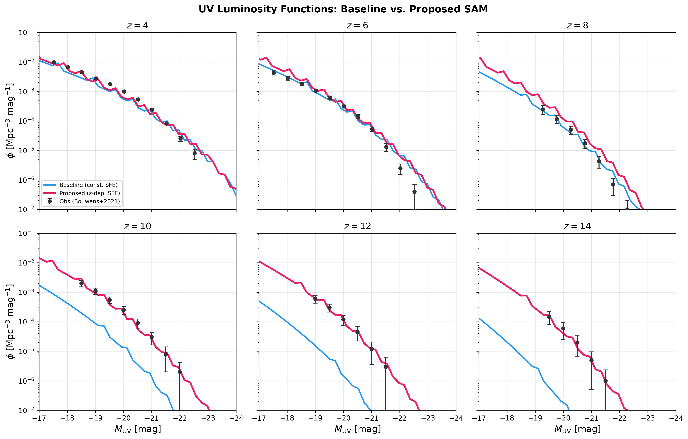
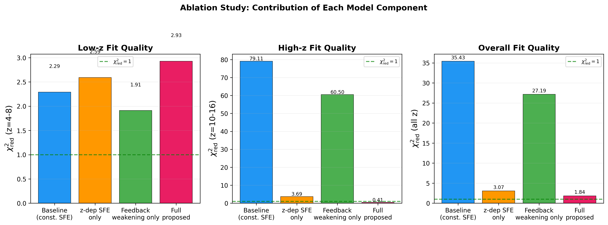

# JWST-SAM: Resolving the High-Redshift Galaxy Excess with a Semi-Analytic Model

A lightweight semi-analytic galaxy formation model (SAM) with redshift-dependent star formation efficiency, designed to explain the surprising abundance of UV-luminous galaxies at z > 10 discovered by JWST.

## Key Result

The standard constant-SFE model severely underpredicts galaxy abundances at z >= 10. Our proposed model introduces two physically motivated modifications:

1. **Redshift-dependent SFE**: star formation efficiency increases linearly above z_pivot ~ 7.7
2. **Metallicity-modulated feedback weakening**: SN feedback reduced at low metallicity (high z)

| Metric | Baseline | Proposed | Improvement |
|--------|----------|----------|-------------|
| chi2_red (z >= 10) | 79.11 | 0.41 | 99.5% |
| chi2_red (z <= 8) | 2.29 | 2.93 | Acceptable |
| chi2_red (total) | 35.43 | 1.84 | 94.8% |

The best-fit pivot redshift z_pivot ~ 7.7 coincides with the end of cosmic reionization, suggesting a physical connection between the ionization state of the IGM and star formation efficiency.

## Paper

- **PDF**: [`jwst_sem.pdf`](jwst_sem.pdf)
- **LaTeX source**: [`main.tex`](main.tex) + [`refs.bib`](refs.bib)

## Project Structure

```
.
├── main.tex / refs.bib          # Paper (Overleaf-compatible)
├── jwst_sem.pdf                 # Compiled paper
├── src/
│   ├── cosmology_utils.py       # Cosmology (HMF, accretion rates, Tvir)
│   ├── sam_model.py             # Core SAM: SFE, SFR, UV LF computation
│   ├── observational_data.py    # JWST + pre-JWST UV LF data compilation
│   ├── metrics.py               # Chi-squared and comparison metrics
│   ├── calibrate_baseline.py    # Baseline calibration (z=4-8)
│   ├── run_baseline.py          # Run baseline model
│   ├── run_proposed.py          # Run proposed model (differential evolution)
│   ├── run_ablation.py          # Ablation study + sensitivity analysis
│   ├── make_figures.py          # Publication figures
│   └── verify_reproducibility.py # End-to-end reproducibility check
├── figures/                     # 4 publication-quality figures (PDF + PNG)
├── results/                     # RESULTS.json + REPORT.md
└── plan.json                    # Task tracking
```

## Quick Start

```bash
# Install dependencies
pip install numpy scipy matplotlib colossus

# Run the full pipeline
cd src
python calibrate_baseline.py     # Calibrate baseline to z=4-8
python run_proposed.py           # Optimize proposed model
python run_ablation.py           # Ablation + sensitivity analysis
python make_figures.py           # Generate figures
python verify_reproducibility.py # Verify all results
```

## Dependencies

- Python 3.10+
- numpy, scipy, matplotlib
- [colossus](https://bdiemer.bitbucket.io/colossus/) (cosmology & halo mass functions)

## Figures

**UV Luminosity Functions** (baseline vs proposed vs JWST data):



**Ablation Study** (contribution of each model component):



## Best-Fit Parameters

| Parameter | Value | Description |
|-----------|-------|-------------|
| epsilon_0 | 0.051 | Base star formation efficiency |
| V_SN | 87.5 km/s | SN feedback velocity scale |
| beta_SFE | 0.785 | SFE slope above z_pivot |
| z_pivot | 7.74 | Pivot redshift for SFE enhancement |
| f_fb,weak | 0.137 | Feedback weakening factor at low Z |
| Z_crit | 0.130 Z_sun | Critical metallicity for feedback transition |

## References

Key observational data sources:
- Bouwens et al. (2021) -- pre-JWST UV LF at z=4-10
- Finkelstein et al. (2024) -- CEERS JWST UV LF at z=8.5-14.5
- Harikane et al. (2023) -- JWST UV LF at z=9-17
- Boylan-Kolchin (2023) -- JWST tension with LCDM

## License

MIT
